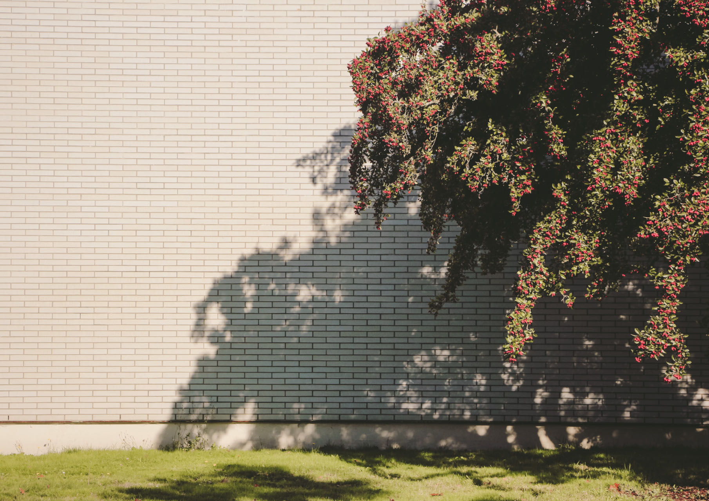

<!--

  
  

    <h3>Gibraltar</h3>
    
Giant Murals bring the imagination to the reality.

  

  
  

    <h3>Portobello Beach, Edinburgh</h3>
    
Giant Murals bring the imagination to the reality.

  

  
  

    <h3>Danboard</h3>
    
Taken in Xiamen.

  

  
  

    <h3>Danboard</h3>
    
Taken in Xiamen.

  

  
  

    <h3>Taken in Vancouver.</h3>
    

  

  
  

    <h3>Taken in Shenzhen, China</h3>
    
Taken in Xiamen

  

  
  

    <h3>North Berwick, Edinburgh</h3>
    

  

  
  

    <h3>Shadow</h3>
    

  

  
  

    <h3>Sunset</h3>
    
Taken in Xiamen

  

  
  

    <h3>Tokyo SkyTree, Japan</h3>
    
Taken in Xiamen

  

-->


  
  
  
  <!--  -->
  
  
  
  
  
  
  
  
  

