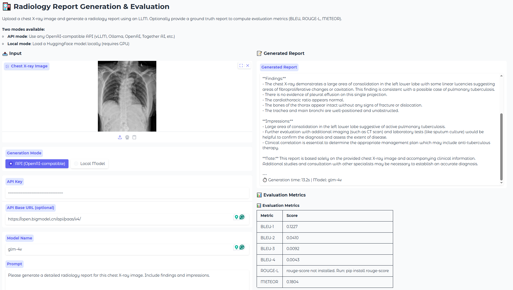

## Open Source Projects

**LLM-based Radiology Report Generation & Evaluation Toolkit**\
A toolkit for generating radiology reports from chest X-ray images using Large Language Models (LLMs), and evaluating the generated reports with multiple clinical and NLG metrics. It provides out-of-the-box support for Qwen series models (Qwen2.5-VL, Qwen3-VL, Qwen3.5), while the evaluation pipeline is model-agnostic — any LLM-generated reports can be evaluated. A Gradio-based Web Demo is also included for interactive single-image report generation and evaluation.\
[GitHub](https://github.com/jinghanSunn/LLM-based-Radiology-Report-Generation-Evaluation-Toolkit)

 
