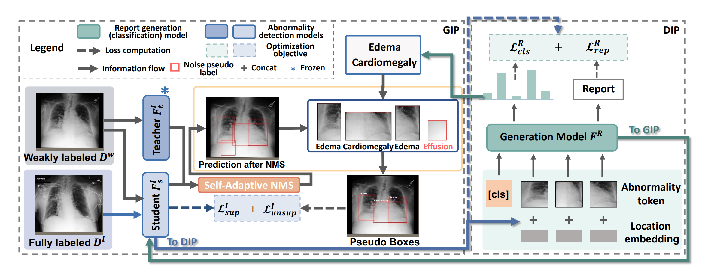
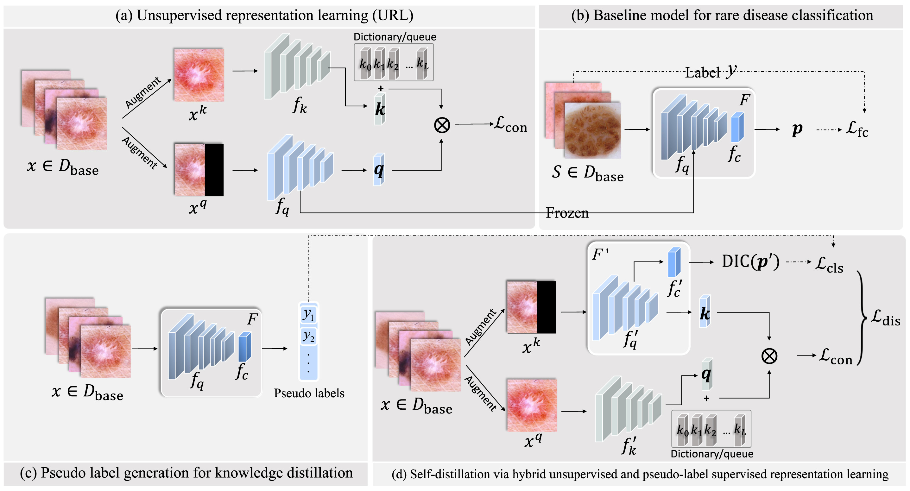
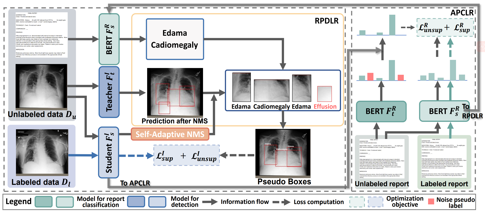
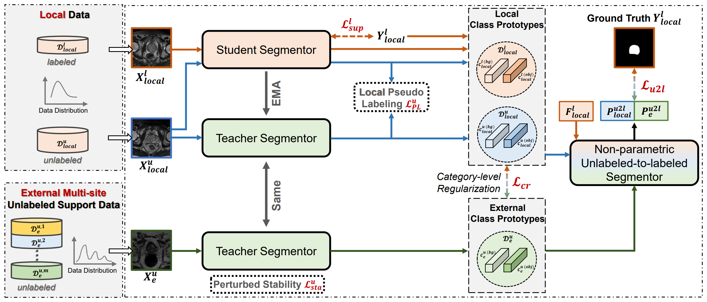
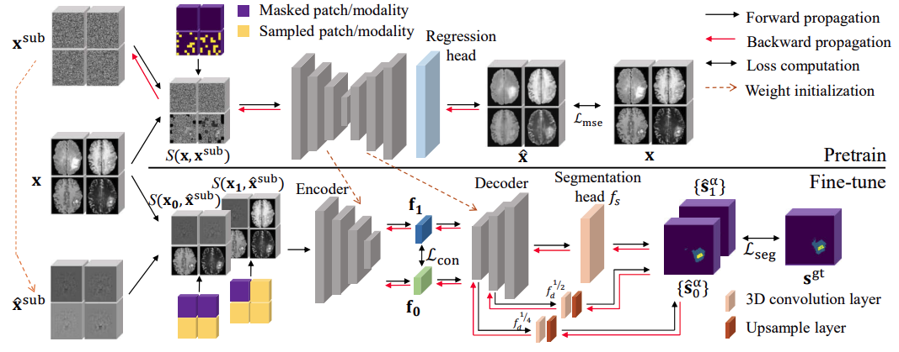
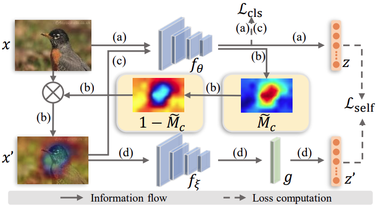
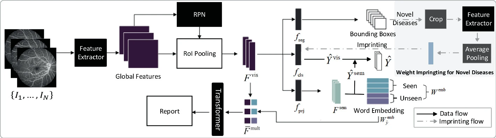

## [Full List](https://scholar.google.com.hk/citations?user=T0ru9jYAAAAJ&hl=zh-CN)

## Journal

<!--  -->

**Unlocking the Potential of Weakly Labeled Data: A Co-Evolutionary Learning Framework for Abnormality Detection and Report Generation**\
**Jinghan Sun**, Dong Wei, Zhe Xu, Donghuan Lu, Hong Liu, Hong Wang, Liansheng Wang, Sotirios A. Tsaftaris, Steven McDonagh, Yefeng Zheng.\
*IEEE TMI, 2024.*
[Paper](https://ieeexplore.ieee.org/document/10798513)

 

**Hybrid unsupervised representation learning and pseudo-label supervised self-distillation for rare disease imaging phenotype classification with dispersion-aware imbalance correction**\
**Jinghan Sun**, Dong Wei, Liansheng Wang, Yefeng Zheng.\
*Medical Image Analysis (MedIA), 2024.*\
[Paper](https://www.sciencedirect.com/science/article/pii/S1361841524000276), [Code](https://github.com/jinghanSunn/Hybrid-Representation-Learning-Approach-for-Rare-Disease-Classification)

 

## Conference

**You've Got Two Teachers: Co-evolutionary Image and Report Distillation for Semi-supervised Anatomical Abnormality Detection in Chest X-ray**\
**Jinghan Sun**, Dong Wei, Zhe Xu, Donghuan Lu, Hong Liu, Liansheng Wang, Yefeng Zheng.\
*Medical Image Computing and Computer Assisted Interventions (MICCAI), 2023.*\
[Paper](https://link.springer.com/chapter/10.1007/978-3-031-43907-0_35), [Code](https://github.com/jinghanSunn/CEIRD)

 

**Category-Level Regularized Unlabeled-to-Labeled Learning for Semi-supervised Prostate Segmentation with Multi-site Unlabeled Data**\
Zhe Xu, Donghuan Lu, Jiangpeng Yan, **Jinghan Sun**, Jie Luo, Dong Wei, Sarah Frisken, Quanzheng Li, Yefeng Zheng, Raymond Tong.\
*Medical Image Computing and Computer Assisted Interventions (MICCAI), 2023.*\
[Paper](https://link.springer.com/chapter/10.1007/978-3-031-43901-8_1)

 

**M3AE: Multimodal Representation Learning for Brain Tumor Segmentation with Missing Modalities**\
Hong Liu, Dong Wei, Donghuan Lu, **Jinghan Sun**, Liansheng Wang, Yefeng Zheng.\
*Proceedings of the AAAI Conference on Artificial Intelligence (AAAI), 2023.*\
[Code](https://ojs.aaai.org/index.php/AAAI/article/view/25253), [Code](https://github.com/ccarliu/m3ae)

 

**Boost Supervised Pretraining for Visual Transfer Learning: Implications of Self-Supervised Contrastive Representation Learning**\
**Jinghan Sun**, Dong Wei, Kai Ma, Liansheng Wang, Yefeng Zheng.\
*Proceedings of the AAAI Conference on Artificial Intelligence (AAAI), 2022.*\
[Paper](https://ojs.aaai.org/index.php/AAAI/article/view/20129), [Code](https://github.com/jinghanSunn/CAMtrast)

 

**Lesion guided explainable few weak-shot medical report generation**\
**Jinghan Sun**, Dong Wei, Liansheng Wang, Yefeng Zheng.\
*Medical Image Computing and Computer Assisted Intervention (MICCAI), 2022.*\
[Paper](https://link.springer.com/chapter/10.1007/978-3-030-87240-3_50), [Code](https://github.com/jinghanSunn/Hybrid-Representation-Learning-Approach-for-Rare-Disease-Classification)
